<div align="center">


         

**[🌐 Portal en vivo](https://distilroberta.iagentek.com.mx)** · **[📦 Entregables](https://distilroberta.iagentek.com.mx/entregables)** · **[🧪 Simulación](https://distilroberta.iagentek.com.mx/simulacion)** · **[🛡️ Cumplimiento](https://distilroberta.iagentek.com.mx/cumplimiento)**

*UNIR · Maestría en Inteligencia Artificial · Sistemas Cognitivos Artificiales · Actividad 2 (individual)*
*«Transformers y Modelos de Lenguaje Grande (LLM)» — Adonai Samael Hernández Mata*

</div>

> [!NOTE]
> **Todo lo que aparece en este README se generó a partir de la ejecución real** (`python ml/generar_readme.py`):
> cifras leídas de `artefactos/`, figuras extraídas del notebook ejecutado y, en el banner, la predicción real del modelo
> afinado sobre la consulta «I still have not received my card» → `card_arrival` (99.1 %).

## ✨ Resultados en una mirada

| Accuracy (prueba) | F1 macro | Errores | Fine-tuning | Explicaciones pertinentes | Exigencias cumplidas |
|---|---|---|---|---|---|
| 🎯 **93.25 %** | 📊 **0.932** | ❌ **208** | ⏱️ **8.0 min** | 🧪 **7/20** | ✅ **41/41** |

## 🧭 Contenido

- [🔄 Cómo funciona](#-cómo-funciona)
- [📈 1 · Análisis exploratorio](#-1--análisis-exploratorio)
- [🤖 2 · Clasificación con DistilRoBERTa](#-2--clasificación-con-distilroberta)
- [💬 3 · Explicación de errores con Falcon-7b-instruct](#-3--explicación-de-errores-con-falcon-7b-instruct)
- [🛡️ Cumplimiento de la rúbrica](#️-cumplimiento-de-la-rúbrica)
- [🌐 El portal](#-el-portal)
- [🏗️ Arquitectura y despliegue](#️-arquitectura-y-despliegue)
- [🛠️ Reproducir](#️-reproducir)
- [📚 Referencias](#-referencias)

## 🔄 Cómo funciona

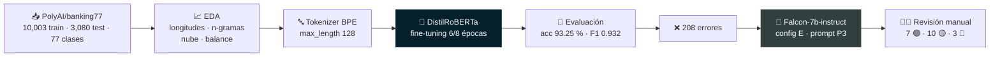

## 📈 1 · Análisis exploratorio

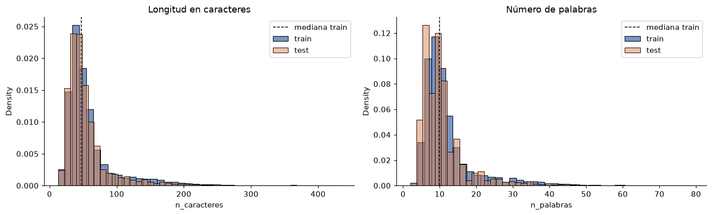

<details open>
<summary><b>📐 Estadísticas descriptivas</b></summary>

| Métrica | Partición | Media | Mediana | Máx. |
|---|---|---|---|---|
| caracteres | test | 54.23 | 45 | 368 |
| caracteres | train | 59.47 | 47 | 433 |
| palabras | test | 10.95 | 9 | 69 |
| palabras | train | 11.95 | 10 | 79 |
| tokens | test | 14.67 | 13 | 81 |
| tokens | train | 15.80 | 13 | 96 |

</details>

<details>
<summary><b>🔠 Palabras, bigramas y trigramas más frecuentes (texto limpio)</b></summary>

| # | Palabra | Bigrama | Trigrama |
|---|---|---|---|
| 1 | card (3,591) | exchange rate (361) | disposable virtual card (107) |
| 2 | account (1,716) | new card (286) | exchange rate wrong (50) |
| 3 | money (1,407) | virtual card (282) | get money back (40) |
| 4 | transfer (1,392) | card payment (266) | transfer money account (40) |
| 5 | top (1,381) | would like (227) | get virtual card (39) |
| 6 | get (1,045) | cash withdrawal (207) | direct debit payment (39) |
| 7 | need (927) | money account (159) | charged extra fee (39) |
| 8 | payment (921) | transfer money (151) | get new card (36) |
| 9 | cash (884) | long take (151) | would like know (33) |
| 10 | exchange (708) | still pending (150) | virtual card work (32) |

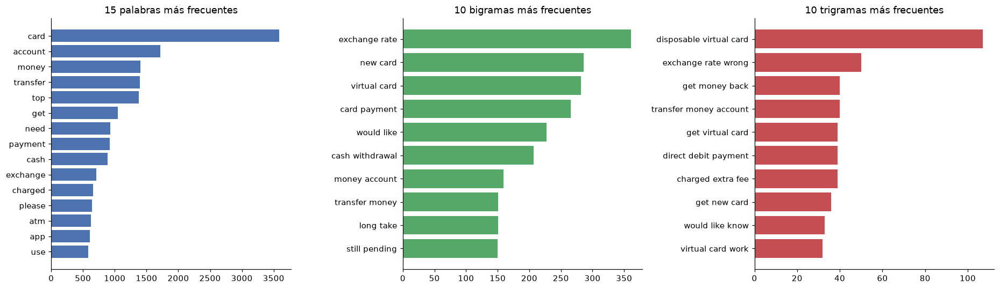

</details>

<table><tr>
<td width="50%">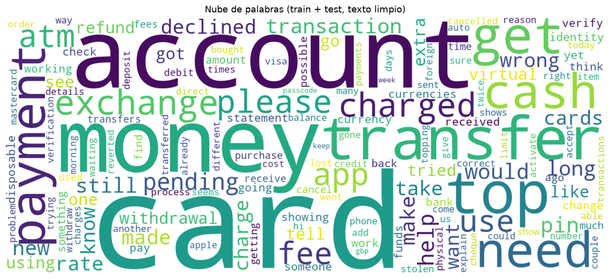</td>
<td width="50%">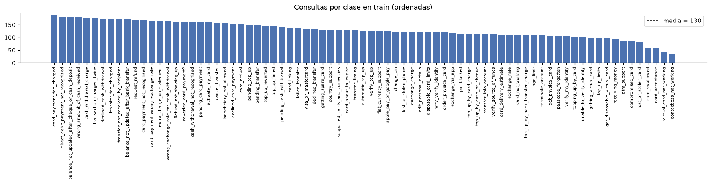</td>
</tr></table>

**Balance:** de 35 (`contactless_not_working`) a 187 (`card_payment_fee_charged`)
ejemplos por clase en train — razón 5.34×, entropía normalizada 0.992. La prueba tiene 40 por clase.

## 🤖 2 · Clasificación con DistilRoBERTa

<table><tr>
<td width="50%">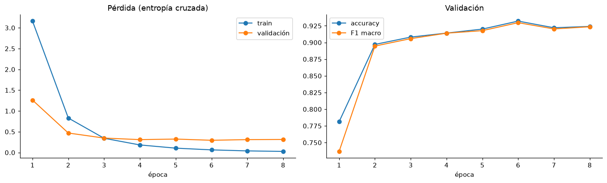</td>
<td width="50%">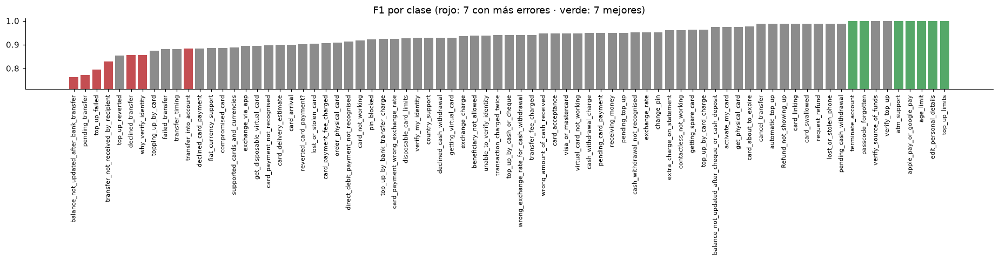</td>
</tr></table>

<details open>
<summary><b>📉 Curva por época (⭐ = época elegida por F1 macro en validación)</b></summary>

| Época | Pérdida train | Pérdida validación | Accuracy val. | F1 macro val. |
|---|---|---|---|---|
| 1 | 3.1616 | 1.2612 | 0.7812 | 0.7367 |
| 2 | 0.8302 | 0.4696 | 0.8971 | 0.8946 |
| 3 | 0.3430 | 0.3482 | 0.9081 | 0.9058 |
| 4 | 0.1827 | 0.3106 | 0.9141 | 0.9140 |
| 5 | 0.1058 | 0.3242 | 0.9201 | 0.9177 |
| 6 | 0.0642 | 0.2949 | 0.9321 | 0.9297 ⭐ |
| 7 | 0.0396 | 0.3112 | 0.9221 | 0.9203 |
| 8 | 0.0270 | 0.3146 | 0.9241 | 0.9236 |

</details>

<table><tr>
<td valign="top" width="45%">

**🟢 Las 7 mejor clasificadas**

| Clase | F1 | Errores |
|---|---|---|
| `age_limit` | 1.000 | 0 |
| `apple_pay_or_google_pay` | 1.000 | 0 |
| `atm_support` | 1.000 | 0 |
| `edit_personal_details` | 1.000 | 0 |
| `passcode_forgotten` | 1.000 | 0 |
| `terminate_account` | 1.000 | 0 |
| `top_up_limits` | 1.000 | 0 |

</td>
<td valign="top" width="55%">

**🔴 Las 7 con más errores**

| Clase | F1 | Precision | Recall | Errores |
|---|---|---|---|---|
| `pending_transfer` | 0.771 | 0.900 | 0.675 | 13 |
| `declined_transfer` | 0.857 | 1.000 | 0.750 | 10 |
| `top_up_failed` | 0.795 | 0.816 | 0.775 | 9 |
| `balance_not_updated_after_bank_transfer` | 0.762 | 0.727 | 0.800 | 8 |
| `why_verify_identity` | 0.857 | 0.892 | 0.825 | 7 |
| `transfer_not_received_by_recipient` | 0.829 | 0.810 | 0.850 | 6 |
| `transfer_into_account` | 0.883 | 0.919 | 0.850 | 6 |

</td>
</tr></table>

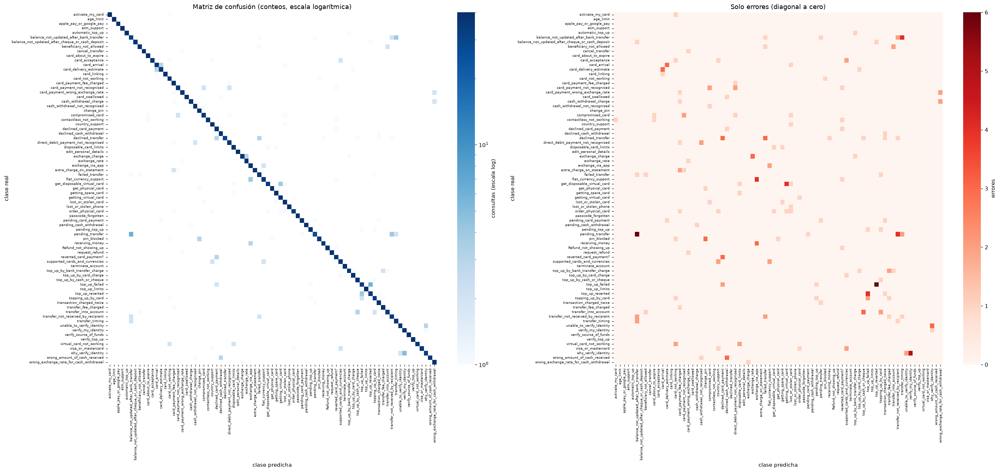

### 🔎 ¿Por qué se equivoca? Dos hipótesis del EDA, medidas

| Hipótesis | Medida en el notebook (§ 3.6) | Lectura |
|---|---|---|
| **H1** · el desbalance causa los errores | ρ(ejemplos de train, F1) = **-0.144** (p = 0.21) | ⚪ sin evidencia a favor |
| **H2** · el vocabulario compartido se asocia a los errores | bigramas compartidos: **0.042** vs **0.005** (**9×**), ρ = 0.306 | 🟢 asociación confirmada |
| Similitud TF-IDF entre clases | ρ(similitud, errores del par) = **0.282** | 🟢 las clases fallan hacia sus vecinas |
| Errores dentro de la misma familia | **68.3%** (142 de 208) | 🟢 transferencias, recargas, tarjetas… |
| Errores con confianza > 0.90 | **34.6%** (72 de 208) · confianza media 0.971 aciertos vs 0.752 errores | 🟡 la confianza no basta para abstenerse |

## 💬 3 · Explicación de errores con Falcon-7b-instruct

Se calibraron los **tres ejes** que pide el enunciado: temperatura, longitud de respuesta y estructura del prompt,
con reglas de elección fijadas antes de ver los resultados. Ganó la **configuración E** (temperature=0.3, top_p=0.9,
`max_new_tokens=150`) con la **estructura P3**.

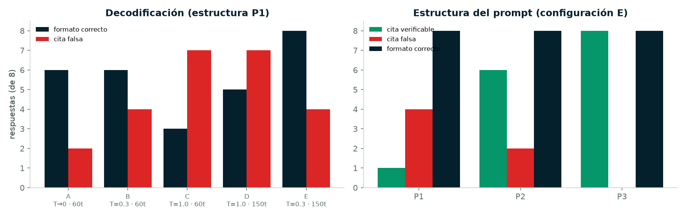

<details>
<summary><b>🎛️ Calibración de la decodificación (estructura P1)</b></summary>

| Config. | Parámetros | Formato correcto | Citas falsas | Respuestas |
|---|---|---|---|---|
| A | T→0 · 60t | 6 | 2 | 8 |
| B | T=0.3 · 60t | 6 | 4 | 8 |
| C | T=1.0 · 60t | 3 | 7 | 8 |
| D | T=1.0 · 150t | 5 | 7 | 8 |
| E | T=0.3 · 150t | 8 | 4 | 8 |

</details>

<details>
<summary><b>🧱 Calibración de la estructura (configuración E)</b></summary>

| Estructura | Citas verificables | Citas falsas | Formato correcto | Respuestas |
|---|---|---|---|---|
| P1 | 1 | 4 | 8 | 8 |
| P2 | 6 | 2 | 8 | 8 |
| P3 | 8 | 0 | 8 | 8 |

</details>

<details>
<summary><b>🇬🇧 / 🇪🇸 El prompt elegido, tal como se envió (ejemplo: error n.º 1)</b></summary>

```text
You are a banking customer-support analyst who audits an automatic intent classifier.
The classifier read the customer query below and predicted an intent that differs from the label in the dataset.
In at most two short sentences, explain which words of the query led the classifier to the predicted intent, quoting those words between single quotes exactly as they appear in the query. Do not invent facts, do not give advice to the customer.

Customer query: "I think my top up has been reverted"
Predicted intent: top up failed
Dataset label: top up reverted

Explanation: The query mentions 'top up' and a reverted top-up looks like a failed one, which pushes toward top up failed. The word 'reverted' is what points to the label.

Customer query: "How long is the wait for my card?"
Predicted intent: card arrival
Dataset label: card delivery estimate

Explanation: The words 'wait' and 'my card' are typical of messages about cards that have not arrived. 'How long' asks for a delivery time, which fits the label better.

Customer query: "I would like to know why my payment is still pending, can you help?"
Predicted intent: pending card payment
Dataset label: pending transfer

Explanation:
```

</details>

<table><tr>
<td width="40%">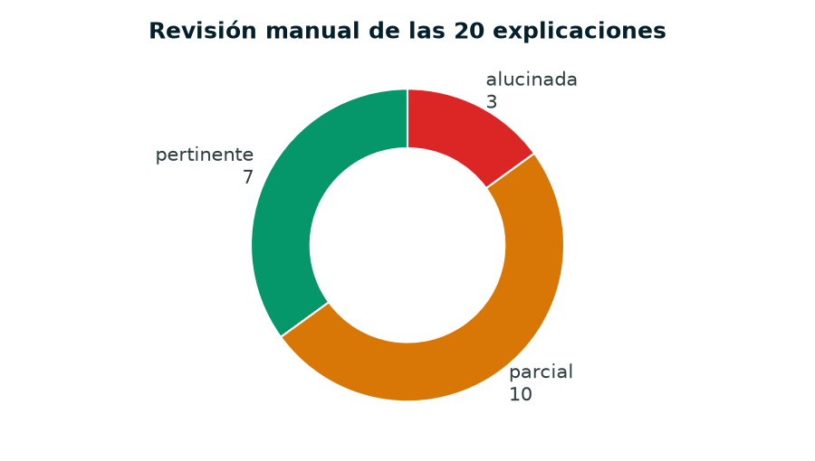</td>
<td width="60%">

**Razones que da el LLM**

| Razón | Explicaciones |
|---|---|
| solapamiento lexico | 16 |
| ambiguedad real | 2 |
| etiqueta dudosa | 2 |

</td>
</tr></table>

<details>
<summary><b>📝 Las 20 explicaciones y su veredicto manual</b></summary>

| # | Consulta | Real | Predicha | Veredicto |
|---|---|---|---|---|
| 1 | “I would like to know why my payment is still pending, can you help?” | `pending_transfer` | `pending_card_payment` | 🟡 parcial |
| 2 | “I was double charged, and the second charge is showing as "pending". How long will it be before I get my money back once the second charge has been refunded?” | `pending_card_payment` | `transaction_charged_twice` | 🟡 parcial |
| 3 | “Where do I find the exchange rate?” | `exchange_charge` | `exchange_rate` | 🟡 parcial |
| 4 | “how many transactions can i make with a disposable card” | `get_disposable_virtual_card` | `disposable_card_limits` | 🔴 alucinada |
| 5 | “Am I able to exchange currencies?” | `fiat_currency_support` | `exchange_via_app` | 🟡 parcial |
| 6 | “Can I change my currency from USD to EUR?” | `exchange_via_app` | `fiat_currency_support` | 🔴 alucinada |
| 7 | “My card is just not working at this time.” | `virtual_card_not_working` | `card_not_working` | 🟡 parcial |
| 8 | “When will my transfer be available in my account.” | `balance_not_updated_after_bank_transfer` | `transfer_timing` | 🟢 pertinente |
| 9 | “whats your exchange rate” | `exchange_charge` | `exchange_rate` | 🟢 pertinente |
| 10 | “What are the fees for top-ups?” | `top_up_by_bank_transfer_charge` | `top_up_by_card_charge` | 🟢 pertinente |
| 11 | “How do I top up my card?” | `transfer_into_account` | `topping_up_by_card` | 🟢 pertinente |
| 12 | “Someone has taken my money and I don't know who” | `direct_debit_payment_not_recognised` | `cash_withdrawal_not_recognised` | 🔴 alucinada |
| 13 | “The app wouldn't accept my top up.” | `top_up_reverted` | `top_up_failed` | 🟡 parcial |
| 14 | “How do I unblock my card using the app?” | `card_not_working` | `pin_blocked` | 🟡 parcial |
| 15 | “Will declined funds I tried to withdraw be returned to me?” | `wrong_amount_of_cash_received` | `declined_cash_withdrawal` | 🟢 pertinente |
| 16 | “What can I use a virtual disposable card for?” | `disposable_card_limits` | `get_disposable_virtual_card` | 🟡 parcial |
| 17 | “Where can I view my PIN?” | `pin_blocked` | `get_physical_card` | 🟢 pertinente |
| 18 | “My card is being declined for a purchase. I bought items before and the card worked. Do you know what the problem is?” | `reverted_card_payment?` | `declined_card_payment` | 🟢 pertinente |
| 19 | “How long can an EU transfer take?” | `pending_transfer` | `transfer_timing` | 🟡 parcial |
| 20 | “How can I top-up my card?” | `top_up_by_cash_or_cheque` | `topping_up_by_card` | 🟡 parcial |

</details>

## 🛡️ Cumplimiento de la rúbrica

| Criterio | Descripción | Puntos | Peso | Exigencias |
|---|---|---|---|---|
| C1 | Análisis exploratorio de datos | 1.5 | 15 % | 10/10 ✅ |
| C2 | Entrenamiento de transformer | 2.5 | 25 % | 8/8 ✅ |
| C3 | Diseño de prompt | 3.0 | 30 % | 10/10 ✅ |
| C4 | Conclusiones | 2.0 | 20 % | 3/3 ✅ |
| C5 | Código comentado y referencias | 1.0 | 10 % | 5/5 ✅ |
| EN | Entrega y notas técnicas | — | — | 5/5 ✅ |

33 exigencias del enunciado · 7 del nivel 4 de la rúbrica detallada · 1 solicitud adicional.
Detalle con evidencia en **[/cumplimiento](https://distilroberta.iagentek.com.mx/cumplimiento)**.

## 🌐 El portal

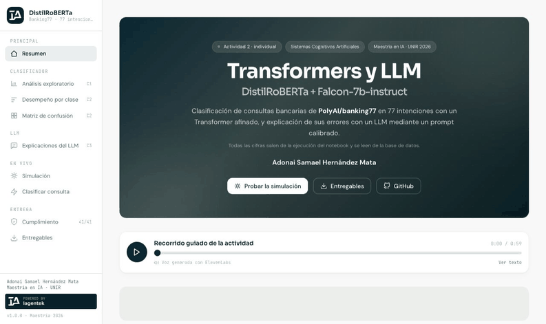

|  | Página | Qué muestra |
|---|---|---|
| 🏠 | [Resumen](https://distilroberta.iagentek.com.mx/resumen) | KPI animados, curvas de entrenamiento y narración guiada |
| 📈 | [Análisis exploratorio](https://distilroberta.iagentek.com.mx/eda) | Estadísticas, n-gramas, nube de palabras y balance |
| 🗂️ | [Desempeño por clase](https://distilroberta.iagentek.com.mx/clases) | Las 77 clases, ordenables, con las 7 mejores y 7 peores |
| 🔥 | [Matriz de confusión](https://distilroberta.iagentek.com.mx/confusion) | Mapa de calor animado con foco por fila/columna |
| 💬 | [Explicaciones del LLM](https://distilroberta.iagentek.com.mx/explicaciones) | Las 20 explicaciones, su veredicto y el prompt EN/ES |
| 🧪 | [Simulación](https://distilroberta.iagentek.com.mx/simulacion) | Una consulta real paso a paso: tokens, 6 capas, top-5 y Falcon |
| ⚡ | [Clasificar](https://distilroberta.iagentek.com.mx/clasificar) | Inferencia en vivo encolada en Celery + Redis |
| 🛡️ | [Cumplimiento](https://distilroberta.iagentek.com.mx/cumplimiento) | Cada exigencia del enunciado y de la rúbrica con su evidencia |
| 📦 | [Entregables](https://distilroberta.iagentek.com.mx/entregables) | ZIP para el profesor, notebook, PDF, figuras y datos con SHA-256 |

## 🏗️ Arquitectura y despliegue

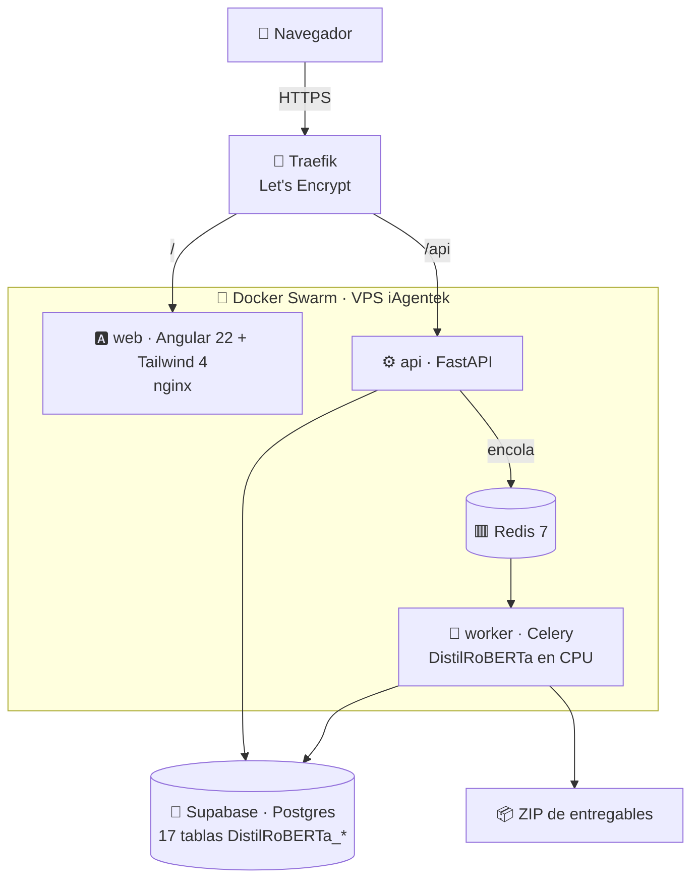

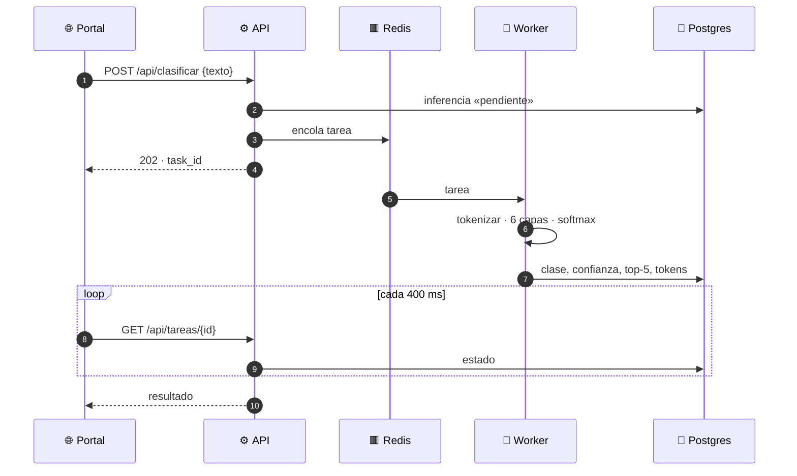

| Pieza | Detalle |
|---|---|
| 🧠 Modelo servido | DistilRoBERTa afinado, CPU, cargado una vez por proceso del worker |
| 💬 LLM | Falcon-7b (≈ 14 GB) **no** se sirve: sus salidas se generaron offline y se publican como datos |
| 🐘 Datos | Tablas `DistilRoBERTa_*` con RLS forzado; solo el rol de la app las lee; `anon` recibe *permission denied* |
| 🔐 Secretos | DSN en un secreto de Docker Swarm, nunca en el repositorio |
| 🛡️ Seguridad web | HSTS, CSP estricta sin scripts inline, anti-*clickjacking*, límite de peticiones por IP, cuerpo máx. 8 KB, escrituras con cabecera anti-CSRF, sin `/docs` públicos, nginx sin privilegios |
| 🎨 Diseño | Forest Design System de iAgentek (el mismo de las demás apps de la maestría) |
| 🔊 Narraciones | 3 de 3 con audio generado con ElevenLabs; todas con transcripción en el portal |

## 🛠️ Reproducir

```bash
# 1 · Entorno
uv venv .venv-ml --python 3.11 && source .venv-ml/bin/activate
uv pip install torch transformers datasets accelerate scikit-learn pandas matplotlib seaborn nltk wordcloud jupyter nbclient nbconvert "psycopg[binary]"

# 2 · Notebook de punta a punta (se pausa para la revisión manual de las 20 explicaciones)
python ml/construir_notebook.py && python ml/ejecutar_notebook.py
python ml/interpretar.py && python ml/exportar_pdf.py

# 3 · Resultados, simulación, entregables y README
python ml/simulacion_llm.py && python ml/cumplimiento.py && python ml/generar_readme.py

# 4 · Base de datos y despliegue
psql "$DSN_ADMIN" -f db/migraciones/001_esquema.sql   # … hasta 005
./deploy/deploy.sh
```

<details>
<summary><b>📁 Estructura del repositorio</b></summary>

```text
notebooks/   Notebook entregable (.ipynb) y su PDF
ml/          construir · ejecutar · interpretar · exportar_pdf · simulacion_llm · cumplimiento · generar_readme
artefactos/  Resultados de la corrida (JSON/CSV) → base de datos y README
data/        CSV oficiales de banking77
db/          Migraciones SQL (tablas DistilRoBERTa_*, rol propio, RLS)
backend/     FastAPI + Celery (Redis)
frontend/    Angular 22 + Tailwind 4 (Forest Design System)
deploy/      stack.yml (Docker Swarm + Traefik) y deploy.sh
docs/readme/ Banner animado, figuras y gráficas de este README
_bmad*/      BMad Method (arquitectura, épicas, sprint)
```

La planificación (constitución, especificación, plan, modelo de datos, contrato REST y tareas) se hizo con
**Spec Kit** en la carpeta hermana `espesificaciones/`; el desarrollo, con **BMad Method**.

</details>

## 📚 Referencias

<details>
<summary><b>20 referencias en formato APA</b> (copiadas de la sección 6 del notebook)</summary>

- Almazrouei, E., Alobeidli, H., Alshamsi, A., et al. (2023). *The Falcon Series of Open Language
- Brown, T., Mann, B., Ryder, N., et al. (2020). Language Models are Few-Shot Learners. *NeurIPS*.
- Casanueva, I., Temčinas, T., Gerz, D., Henderson, M., & Vulić, I. (2020). Efficient Intent
- Cui, Y., Jia, M., Lin, T.-Y., Song, Y., & Belongie, S. (2019). Class-Balanced Loss Based on Effective
- Dettmers, T., Pagnoni, A., Holtzman, A., & Zettlemoyer, L. (2023). QLoRA: Efficient Finetuning of
- Devlin, J., Chang, M.-W., Lee, K., & Toutanova, K. (2019). BERT: Pre-training of Deep
- Guo, C., Pleiss, G., Sun, Y., & Weinberger, K. Q. (2017). On Calibration of Modern Neural Networks.
- Holtzman, A., Buys, J., Du, L., Forbes, M., & Choi, Y. (2020). The Curious Case of Neural Text
- Ji, Z., Lee, N., Frieske, R., et al. (2023). Survey of Hallucination in Natural Language
- Liu, Y., Ott, M., Goyal, N., et al. (2019). *RoBERTa: A Robustly Optimized BERT Pretraining
- Lundberg, S. M., & Lee, S.-I. (2017). A Unified Approach to Interpreting Model Predictions. *NeurIPS*.
- Northcutt, C., Jiang, L., & Chuang, I. (2021). Confident Learning: Estimating Uncertainty in Dataset
- Sanh, V., Debut, L., Chaumond, J., & Wolf, T. (2019). *DistilBERT, a distilled version of BERT:
- Sennrich, R., Haddow, B., & Birch, A. (2016). Improving Neural Machine Translation Models with
- Sundararajan, M., Taly, A., & Yan, Q. (2017). Axiomatic Attribution for Deep Networks. *ICML*.
- Vaswani, A., Shazeer, N., Parmar, N., et al. (2017). Attention Is All You Need. *NeurIPS*.
- Wei, J., & Zou, K. (2019). EDA: Easy Data Augmentation Techniques for Boosting Performance on Text
- Wolf, T., Debut, L., Sanh, V., et al. (2020). Transformers: State-of-the-Art Natural Language
- Ying, C., & Thomas, S. (2022). Label Errors in BANKING77. *Proceedings of the Third Workshop on
- Documentación de Hugging Face: `PolyAI/banking77`, ficha de `distilbert/distilroberta-base`,

</details>

<div align="center">
<sub>Hecho con 🌲 Forest Design System · <b>powered by iAgentek</b> · Maestría en IA · UNIR 2026</sub>
</div>
