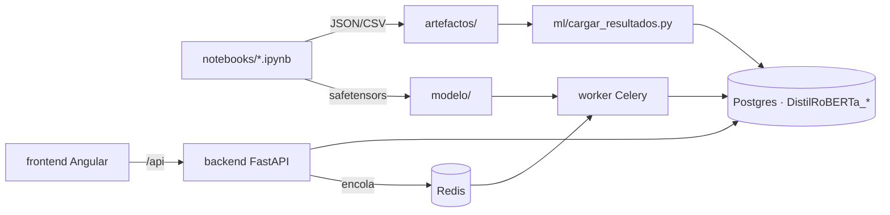

# Architecture Spine — DistilRoBERTa · Banking77

> La **planificación vive en Spec Kit** (`espesificaciones/`). Este documento no la repite: fija
> solo las reglas que mantienen coherentes las piezas que BMad construye por separado.

## Design Paradigm

## Invariants & Rules

### AD-1 — El notebook es la única fuente de cifras [ADOPTED]
- **Binds:** FR-018, FR-019, SC-005
- **Prevents:** números distintos entre PDF y web.
- **Rule:** toda cifra de la web se lee de `DistilRoBERTa_*`, que solo se llena desde `artefactos/` con el cargador.

### AD-2 — Nomenclatura y aislamiento de datos [ADOPTED]
- **Binds:** FR-018, FR-022, SC-007
- **Rule:** tablas `public."DistilRoBERTa_<tabla>"`; RLS forzado; solo el rol `distilroberta_app` tiene políticas; DSN en el secreto `distilroberta_db_dsn_v1`.

### AD-3 — El LLM de 7 B no se sirve [ADOPTED]
- **Binds:** FR-011..FR-015
- **Rule:** Falcon corre offline en el notebook; la web publica sus salidas como datos.

### AD-4 — Inferencia asíncrona con estado en la base
- **Binds:** FR-020, FR-021, SC-006
- **Rule:** `POST /api/clasificar` crea la fila en `DistilRoBERTa_inferencias` y encola con `task_id = id` de la fila; el worker es el único que la completa; `GET /api/tareas/{id}` lee la fila, no el backend de Celery.

### AD-5 — Despliegue verificable [ADOPTED]
- **Rule:** imágenes `:<sha>`, `restart_policy: any`, router `/api` con `priority=100` sobre el del frontend (`priority=10`), verificación inspect + contenedor + HTTP (`deploy/deploy.sh`).

## Consistency Conventions

| Concern | Convention |
| --- | --- |
| Idioma | Código con nombres en español; etiquetas del dataset en su forma original (`card_arrival`) |
| Ids | `consulta_id`: train = índice, test = 100000 + índice; `corrida_id` = fecha `YYYY-MM-DDTHH-MM` |
| Errores API | `{"detail": "…"}` con el código HTTP |
| Estados de UI | toda página usa `<app-estado>` (carga / error con reintento / vacío) |

## Stack

| Name | Version |
| --- | --- |
| Python | 3.11 |
| transformers / torch | 5.17 / 2.14 |
| FastAPI / Celery / Redis | 0.141 / 5.6 / 7 |
| Angular / Tailwind CSS | 22.2 / 4.3 |
| PostgreSQL (Supabase) | 15.8 |
